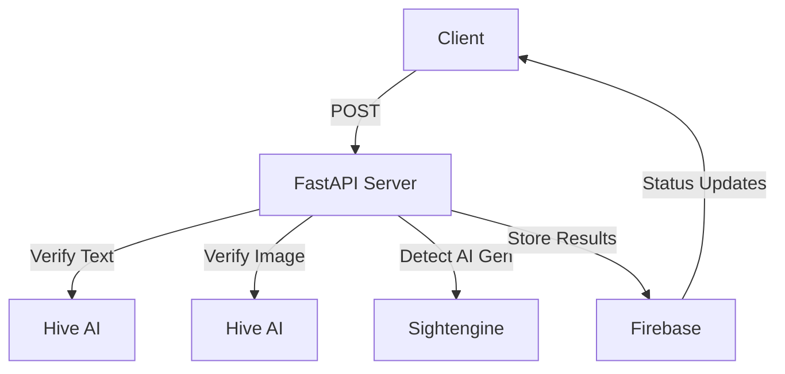

# LocalGram Content Verification Service

Backend service for LocalGram that handles content moderation and verification using AI services.

## Features

- Text content moderation using Hive AI
- Image content moderation using Hive AI
- AI-generated image detection using Sightengine
- Background verification processing
- Real-time Firebase integration
- Rate limiting and exponential backoff
- Comprehensive error handling

## Installation

1. Create a virtual environment:
```bash
python -m venv venv
source venv/bin/activate  # On Windows: venv\Scripts\activate
```

2. Install dependencies:
```bash
pip install -r requirements.txt
```

3. Set up Firebase:
- Create a Firebase project
- Download your Firebase credentials JSON file
- Place it in the root directory as `firebase-credentials.json`

4. Configure environment variables:
- Create a `.env` file with the following:
```
HIVE_API_KEY=your_hive_api_key
SIGHTENGINE_API_USER=your_sightengine_user
SIGHTENGINE_API_SECRET=your_sightengine_secret
```

## API Endpoints

### Content Verification
`POST /api/content-verification`

Request body:
```json
{
    "title": "string",
    "content": "string",
    "image_url": "string"
}
```

Response:
```json
{
    "verification_id": "string",
    "status": "string",
    "is_safe": boolean,
    "is_ai_generated": boolean,
    "issues": ["string"],
    "timestamp": "string"
}
```

### Verification Status
`GET /api/verification-status/{verification_id}`

Response:
```json
{
    "status": "string",
    "details": {
        "text_analysis": {},
        "image_analysis": {}
    }
}
```

## Error Handling

The service implements comprehensive error handling for:
- API rate limits (429 responses)
- Service unavailability
- Invalid content
- Network issues
- Authentication failures

## Development

## Starting the development server will now verify all pending posts in Firestore:
```bash
python -m uvicorn api:app --reload
```

The API will be available at `http://localhost:8000`

## Architecture



